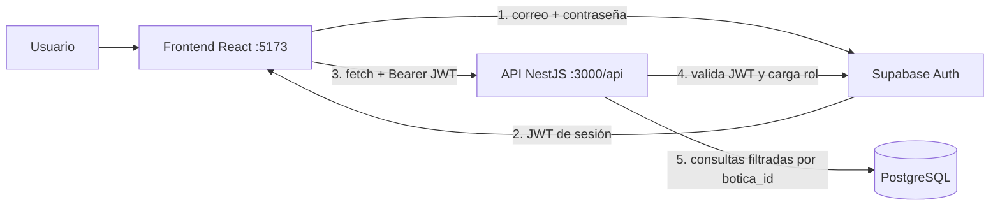

# 💊 Botica SaaS — Inventario, Kardex, Ventas y Reportes

Sistema web **SaaS multi-tenant** para la gestión integral de boticas y farmacias:
control de inventario por lotes, kardex, punto de venta con despacho automático,
alertas de vencimiento y reportes de merma económica. **Proyecto Universitario.**

| Capa | Tecnología |
| --- | --- |
| Frontend | React 19 + Vite + Tailwind CSS v4 + Lucide React |
| Backend | NestJS 11 (TypeScript) + class-validator |
| Base de datos / Auth | Supabase (PostgreSQL 15 + Supabase Auth) |
| Monorepo | pnpm workspaces |

---

## 🗂️ Estructura del monorepo

```
farm-control-stock/
├── package.json                  # Scripts raíz (dev, build)
├── pnpm-workspace.yaml           # Declara backend, frontend y packages/*
├── supabase/
│   ├── esquema.sql               # Tablas, vistas, índices, RLS   ← ejecutar 1º
│   └── semilla.sql               # Datos de demostración          ← ejecutar 2º
├── packages/
│   └── comun/                    # @botica/comun — código compartido
│       └── src/
│           ├── tipos/            # Enumeraciones e interfaces (BD y API)
│           └── utilidades/       # fechas.ts · empaque.ts (cajas ↔ blísters)
├── backend/                  # @botica/backend — API REST NestJS
    │   └── src/
    │       ├── main.ts           # Prefijo /api, ValidationPipe, CORS
    │       ├── app.module.ts     # Ensambla módulos + guardias globales
    │       ├── comun/            # DTO y utilidades de paginación
    │       ├── supabase/         # Cliente Supabase (service_role)
    │       ├── autenticacion/    # Guardias JWT + roles, @UsuarioActual
    │       ├── boticas/          # Configuración del tenant
    │       ├── proveedores/      # Laboratorios y distribuidoras
    │       ├── productos/        # Catálogo + categorías + reactivación
    │       ├── inventario/       # Entradas manuales, mermas y FEFO
    │       │   └── fefo.service.ts  ← algoritmo de despacho y apertura de cajas
    │       ├── kardex/           # Historial + corrección administrativa
    │       ├── ventas/           # Punto de venta (POS)
    │       ├── reportes/         # Reporte diario + merma económica
    │       ├── alertas/          # Motor de alertas + cron horario
    │       └── panel/            # KPIs del dashboard
└── frontend/                 # @botica/frontend — React + Tailwind
        └── src/
            ├── lib/              # api.ts · supabase.ts · permisos.ts
            ├── contexto/         # ContextoAutenticacion (sesión + perfil)
            ├── componentes/
            │   ├── diseno/       # BarraLateral, Encabezado, RutaPorRol
            │   └── ui/           # TarjetaKpi, EtiquetaEstado, Paginacion
            └── paginas/          # PanelControl, PuntoVenta, Productos,
                                  # Inventario, Proveedores, Kardex,
                                  # ReporteDiario, Alertas, Configuracion
```

### ¿Cómo se conectan las piezas?



---

## 🚀 Puesta en marcha

### Requisitos
- Node.js ≥ 20 y **pnpm** ≥ 9 (`npm i -g pnpm`)
- Una cuenta gratuita en [supabase.com](https://supabase.com)

### 1. Crear la base de datos en Supabase
1. **New project** en Supabase.
2. **SQL Editor** → ejecutar **en este orden**:
   1. `supabase/esquema.sql` (tablas, vistas, RLS)
   2. `supabase/semilla.sql` (botica demo con productos, lotes y ventas)

> ⚠️ `esquema.sql` empieza borrando las tablas anteriores para recrearlas.
> Es seguro en desarrollo, pero borra los datos de prueba existentes.

### 2. Crear los usuarios de prueba
En **Authentication → Users → Add user → Create new user** (marque *Auto Confirm User*):

| Correo | Rol que tendrá |
| --- | --- |
| `admin@sanrafael.pe` | ADMIN |
| `almacen@sanrafael.pe` | ALMACENERO |
| `vendedor@sanrafael.pe` | VENDEDOR |

Luego ejecute el bloque `insert into usuarios…` del final de `semilla.sql`:
busca cada UUID automáticamente por el correo. La consulta de verificación
al final debe listar los usuarios creados.

### 3. Variables de entorno
En **Project Settings → API** copie la URL y las claves:

```bash
# backend/.env   (copiar de .env.ejemplo) → URL + clave service_role
# frontend/.env  (copiar de .env.ejemplo) → URL + clave anon
```

> ⚠️ La `URL` es el **Project URL** (`https://xxxx.supabase.co`), sin `/rest/v1/`.
> La clave `service_role` es secreta y solo va en el backend.

### 4. Instalar y ejecutar

```bash
pnpm install
pnpm dev          # compila @botica/comun y levanta backend + frontend
```

- API: `http://localhost:3000/api/salud`
- Web: `http://localhost:5173`

---

## 👥 Roles y permisos (RBAC)

| Acción | ADMIN | ALMACENERO | VENDEDOR |
| --- | :---: | :---: | :---: |
| Punto de venta (POS) | ✅ | — | ✅ |
| Consultar catálogo y stock | ✅ | ✅ | ✅ |
| Crear / editar productos y categorías | ✅ | ✅ | — |
| **Eliminar categorías** | ✅ | — | — |
| Desactivar productos | ✅ | ✅ | — |
| **Reactivar productos** (desde el Kardex) | ✅ | — | — |
| Entradas manuales de mercadería | ✅ | ✅ | — |
| Registrar mermas | ✅ | ✅ | — |
| Gestionar proveedores | ✅ | ✅ | — |
| Ver Kardex y reportes | ✅ | ✅ | — |
| **Corregir registros del Kardex** | ✅ | — | — |
| Configuración de la botica | ✅ | — | — |

El `VENDEDOR` entra directamente al POS: su menú solo muestra Punto de Venta,
Productos (consulta) y Alertas.

---

## 🌐 Endpoints principales

Todos exigen `Authorization: Bearer <JWT>` (excepto `/salud`) y operan **solo**
sobre la botica del usuario autenticado.

| Método | Ruta | Descripción | Rol |
| --- | --- | --- | --- |
| GET | `/api/salud` | Estado de la API (público) | — |
| GET | `/api/autenticacion/perfil` | Usuario + botica del token | autenticado |
| GET | `/api/panel/resumen` | KPIs + productos en atención | autenticado |
| GET | `/api/productos` | Catálogo con stock y semáforos | autenticado |
| GET | `/api/productos/inactivos` | Productos dados de baja | autenticado |
| POST/PATCH | `/api/productos` · `/:id` | Crear / editar producto | ALMACENERO |
| PATCH | `/api/productos/:id/reactivar` | **Reactivar producto** | ADMIN |
| DELETE | `/api/productos/:id` | Baja lógica | ALMACENERO |
| GET/POST | `/api/categorias` | Listar / crear | autenticado / ALMACENERO |
| DELETE | `/api/categorias/:id` | **Eliminar categoría** | ADMIN |
| GET | `/api/proveedores` | Listar proveedores | autenticado |
| POST/PATCH | `/api/proveedores` · `/:id` | Crear / editar | ALMACENERO |
| GET | `/api/inventario/lotes` | Lotes paginados (orden FEFO) | autenticado |
| POST | `/api/inventario/entradas` | Entrada manual (en cajas) | ALMACENERO |
| POST | `/api/inventario/mermas` | Declarar merma valorizada | ALMACENERO |
| POST | `/api/ventas` | **Venta con descuento FEFO** | VENDEDOR |
| GET | `/api/ventas` | Historial de comprobantes | autenticado |
| GET | `/api/kardex` | Historial paginado con filtros | ALMACENERO |
| PATCH | `/api/kardex/:id` | **Corregir un registro** | ADMIN |
| GET | `/api/reportes/diario` | Entradas y salidas + KPIs | ALMACENERO |
| GET | `/api/reportes/merma` | Merma económica en soles | ALMACENERO |
| GET | `/api/alertas` · `/contador` | Alertas y contadores | autenticado |
| POST | `/api/alertas/generar` | Recalcular alertas | autenticado |
| GET/PATCH | `/api/boticas/mia` | Ver / editar configuración | autenticado / ADMIN |

---

## 🎓 Conceptos clave (guía de sustentación)

### 1. Multi-tenant (multi-inquilino)
Todas las boticas comparten tablas; cada fila lleva `botica_id`. El aislamiento
tiene **dos capas**: (a) el backend toma `botica_id` del JWT validado — nunca del
cliente — y filtra cada consulta; (b) **RLS** en PostgreSQL como defensa en
profundidad para accesos directos con la clave pública.

### 2. Unidad base: el blíster
Todo el stock se calcula en **blísters**. Una caja equivale a
`producto.unidades_por_caja` blísters (ej. 1 caja de Amoxicilina = 20 blísters).
Cada lote guarda el stock desglosado:

```
stock_en_blisters = cajas_completas × unidades_por_caja + blisters_sueltos
```

Los productos que se venden por unidad (frascos, geles) usan `unidades_por_caja = 1`.

### 3. Venta por caja y por blíster: apertura automática
Implementado en la función pura `descontarDeLote()`
([fefo.service.ts](backend/src/inventario/fefo.service.ts)):

- **Por CAJA** → consume cajas cerradas. No se rearma una caja juntando blísters
  sueltos, porque ese empaque ya no existe físicamente.
- **Por BLÍSTER** → consume primero los blísters sueltos. Si no alcanzan, **abre
  una caja**: `cajas_completas − 1`, `blisters_sueltos + unidades_por_caja`.
  Vender 1 blíster sin sueltos deja por tanto `unidades_por_caja − 1` disponibles;
  al agotarlos, la caja quedó consumida por completo.

*Ejemplo verificado:* lote con 3 cajas de Amoxicilina (20 blísters c/u) y 0 sueltos.
Se vende 1 blíster → quedan **2 cajas + 19 blísters sueltos**, y el comprobante
del POS indica "se abrió 1 caja".

### 4. FEFO (First Expired, First Out)
`FefoService.despachar()` ordena los lotes disponibles por `fecha_vencimiento`
ascendente, **excluye los vencidos**, y reparte el pedido entre ellos aplicando la
regla anterior. Un despacho puede consumir varios lotes; el POS muestra el detalle
de cada uno como evidencia del algoritmo.

### 5. Estados dinámicos del producto (semáforo)
Los calcula PostgreSQL en la vista `vista_stock_productos`:

| Estado | Regla |
| --- | --- |
| 🟢 Normal | `stock > stock_minimo` |
| 🟡 Atención | `stock ≤ stock_minimo` y `stock > stock_minimo / 2` |
| 🔴 Crítico | `stock = 0` o `stock ≤ stock_minimo / 2` |

Existe un segundo semáforo independiente para el **vencimiento**
(🔴 hay vencidos · 🟡 vence dentro del rango configurado · 🟢 en orden).

### 6. Merma económica en soles
Fórmula del proyecto, valorizada al **costo de compra** (no al precio de venta):

```
merma_soles = cantidad_en_blisters × (costo_caja ÷ unidades_por_caja)
```

El reporte distingue dos conceptos:
- **Merma registrada**: pérdidas ya declaradas (movimientos `SALIDA_MERMA`).
- **Merma potencial**: mercadería vencida que sigue en los lotes sin declararse.

### 7. Kardex y corrección administrativa
Toda operación que mueva stock deja huella en `movimientos_kardex` con su tipo
(`ENTRADA_MANUAL`, `SALIDA_VENTA`, `SALIDA_MERMA`, `AJUSTE_ADMIN`), la cantidad en
la unidad usada **y** normalizada a blísters, y su valorización. El ADMIN puede
corregir un registro; queda marcado con `editado = true`, quién y cuándo, para no
perder la trazabilidad.

### 8. Paginación del lado del servidor
`PaginacionDto` + `calcularRango()` traducen `?pagina=2&porPagina=10` al `.range()`
de Supabase, que devuelve solo esa página más el total exacto. El navegador nunca
descarga miles de movimientos. La usan el Kardex, los lotes, el reporte diario y
el historial de ventas.

### 9. Motor de alertas por reconciliación
`AlertasService.generarAlertas()` calcula el conjunto de alertas que **deberían**
existir y lo compara con las activas: crea las que faltan, refresca mensajes y
**resuelve automáticamente** las que ya no aplican. Es idempotente y lo dispara un
cron horario (`@nestjs/schedule`) o el botón "Recalcular ahora".

---

## ⚠️ Limitaciones conocidas (honestidad académica)

- **Transacciones**: las ventas validan todo antes de tocar la base de datos, pero
  los pasos de descuento y registro no son atómicos. En producción irían dentro de
  una función RPC de PostgreSQL para resistir ventas simultáneas.
- **Correlativo de comprobantes**: se calcula contando ventas previas; la
  restricción `UNIQUE` de la tabla es la garantía final ante concurrencia.
- **Sin pruebas automatizadas** en el repositorio: la lógica de apertura de cajas
  se verificó con pruebas manuales durante el desarrollo.

---

*Proyecto con fines académicos — 2026.*
